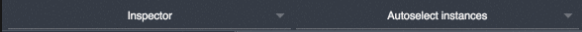
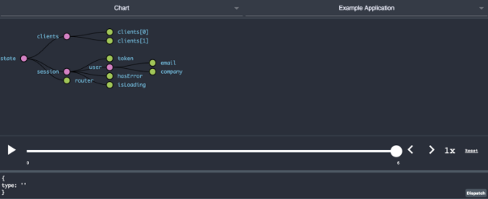
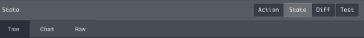
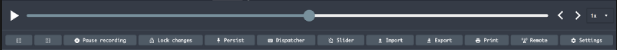

# **It's time to discover Redux Dev Tools**  
"The washing machine" is a familiar syndrome. This syndrome is about the preferences of people while choosing the functionality of the program in their washing machine. Most people choose the same program they are used to, and it is usually the standard program. This syndrome happens in many subjects, one of them in my opinion is redux dev tools.
  
As a SW-developer and especially as a full-stack developer, one major professionality is the ability to debug the state of your application. In this article, I will try to touch not only the "30-40 degrees" program of redux dev tools, but also the other functions including the "100 degree-cotton". The adds-on of 'redux dev tools' is a great tool for interpreting and debugging the application state. I will explain about the chrome extension, but it is also available on Firefox and electron, and can be used as a remote for other browsers and non-browser environments. The review of adds-on features will be top to bottom.  

After installing redux dev tools and configuring it on the store, the adds-on will be available as an extra tab on the inspect mode of the browser.  Redux dev tools adds-on has its own global states, which are shown as 2 @ before each state, for example: @@init / @@pause.   

## Upper dropdowns 

On the left dropdown, you can navigate between the following options: Log monitor, inspector, and chart, while on the right dropdown you can choose your application name from the options or set the default by using the "auto-select instances" option. 
In short, Log Monitor mode and Chart mode are different ways to visualize the application state but show the same data, Inspector mode adds interesting options of debugging.   
### Log monitor
In the log monitor, the action type that was triggered is shown as a title, and the action data with the new state per action is shown as a result below it.  This mode makes logs of all the actions and as a result shows changes in the state. You can initialize the log, reset it, or commit it.  
### Chart 
 
This current state is shown as a tree chart, every action will change the chart according to this rules. 
### Inspector 
On the left side, the log of the actions is shown since the @@init action from redux dev tool was triggered, and it is optional to filter it using the input field. On the right side, there are four categories which help debug the current state. By clicking on 'action' on the left side the data will be replaced to the relevant state:  
  
*Action / State* - Under those tabs, the action or the new state is shown as a tree, chart or raw data.  
*Diff* - Under this tab, only the differences from the last state is shown.  
*Test* - This feature will help you generate unit-tests if TDD isn't your developing methodology. By clicking on 'action' with or without holding SHIFT key to select more than one action, it will produce a new test with mock data using the current state, the action and the relevant reducer. You can use one of the default templates for generating the test or add your own test configuration. Automation is not a dirty word. 

## Bottom features 
 

*Display icons* – these three icons are meant to make the display more comfortable, each icon is used for another type: left bar, right bar or bottom bar. 

*Start / Pause Recording / Slider* – these features will record the application behavior. You can take popcorn and watch your lovely application running your golden-scenario with your beloved ones. 

*Lock changes* – this feature helps freeze the moment. It can be used while debugging the application more carefully. After clicking 'unlock', the application will continue to receive the changes, and the store will return from the dead.  
 
*Persist* - Locks a specific state. It helps work on UI design of specific scenario without reloading it, it can really simplify your life. The feature is available from the application URL, by adding "debug_session=411"(or any other number) to URL.  After refreshing the browser, all the actions will be restored from the local storage.  

*Dispacher* – this feature helps you trigger actions from a console, by adding a type and data in the window as a text.  

*Import \ Export* - This feature shows the greatness of functional programing. It can export your state to json file or import an external state to your application. It can help debug in a very easy way by reproducing a specific scenario, by importing the state.  

*Remote* - If you are using a React Native, hybrid, desktop and server side Redux apps, it will help you debug your app on any device, also in non-browser environments. 
 
**In conclusion**,  
Redux dev tools adds-on is a necessary tool for debugging react-redux application. So, it's time to grow up and not just do your own laundry, but do it with the right functionality.   

  **Go dry it yourself!**
 
  
   
   
  ----
resources:

  [Redux Dev Tools repo](https://github.com/zalmoxisus/redux-devtools-extension)
